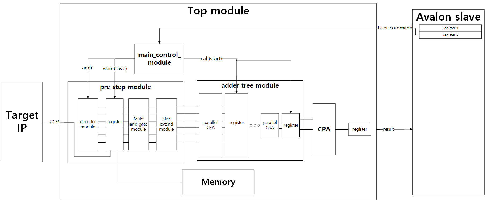

<!--
    Author: Hyun woo Chung
    Last Updated : 2018. 04. 29
    email: resion09@gmail.com
-->

TOP module (가칭)
=================

<!---본문--->
이 모듈은 전력 에뮬레이터의 전력 계산기에 해당하는 모듈을 모두 포함하고 있다. 아래의 내용은 이 모듈이 포함하고 있는 모듈의 상하관계를 설명 해 놓았다.
<!---모듈 분류--->

# Module classify

1. prestep_module
    * decoder_module
    * multi_andgate
    * sign_extend

2. adder_tree_module
    * adder_top_proto
    * adder_block
      * CSA_trees
      * CSA_blocks
3. CPA(Carry Propagation Adder)
    * RCA
    * CLA
    * Parrell prefix adder
      * Kogge-Stone adder
      * Lander-Fisher adder
    * Default - operator +

4. Control_module
5. Memory
    * **Notice** - prototype 에서만 존재할 가능성이 있음

# System diagram
{: width="100px" height="20px"}

# Detail specipic

pipeline을 컨트롤 하고 avalon slave register를 통해서 컨트롤 할 수 있게 지원
  * 전력 계산기의 계산을 위해 준비해야 할 단계