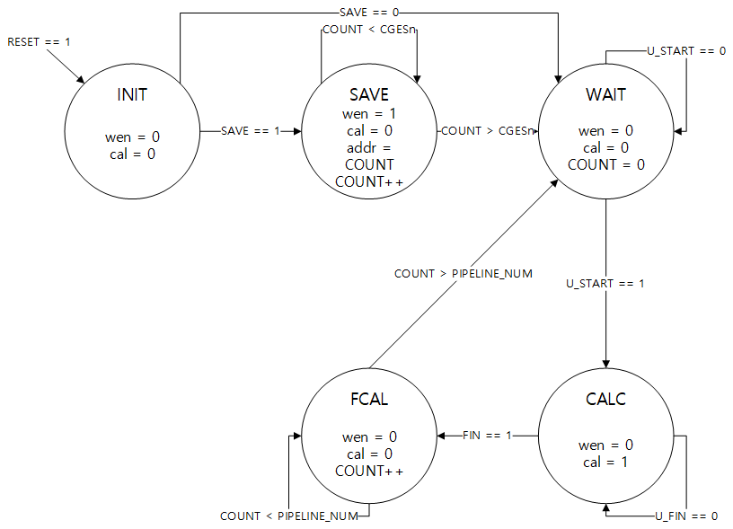

Main control module FSM
==================

# State 설명
* INIT 

  reset signal이 들어왔을 경우 모든 signal을 초기화 시키는 state

* SAVE

    MLR(다중회귀식)의 개수들을 내부 register들로 저장시키는 state

* WAIT

    사용자의 명령이 들어오기 전까지 대기 state

* CALC

    실제 계산하는 state
* FCAL

    전력계산기의 구성을 pipeline으로 구성했기 때문에 마지막 값의 결과가 나올때 까지 대기하는 state

 Cotrol signal
 ===========

| Signal name | Bit width | Description                                                                             |
|-------------|-----------|-----------------------------------------------------------------------------------------|
| wen         | 1 bit     | write enable signal이며 prestep에 있는 내부 register에 값을 저장할 때 사용                              |
| cal         | 1 bit     | wait state에서 calc state로 넘어가기 위한 신호이며 사용자의 register안에 값을 쓸 때 state를 바꾸게 하기 위한 signal |
